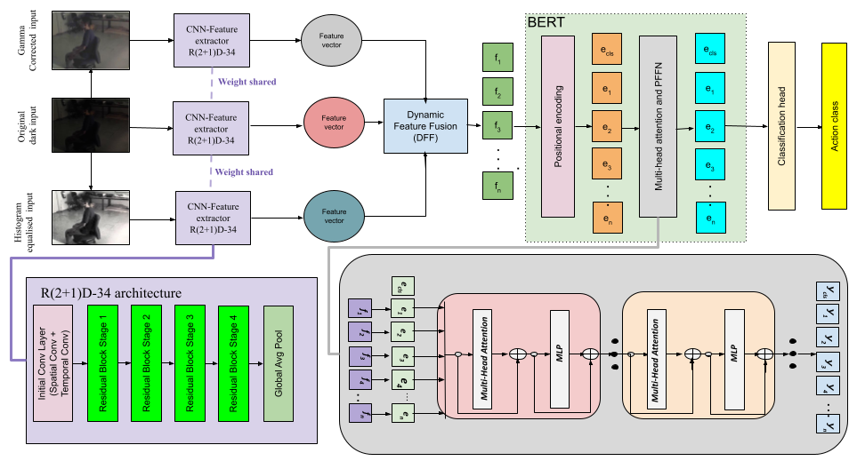

# We will release the code soon!! #

# MD-BERT: Action Recognition in Dark Videos via Dynamic Multi-Stream Fusion and Temporal Modeling

This page contains all the Datasets and Code bases (experiments and evaluations) involved in experimenting and establishing our newly proposed **MD-BERT or MultiDark-BERT** framework for video action recognition in the Dark.

The official repository of the paper with supplementary: [MD-BERT]()!!

## About the project

This project is a carried out in [Monash University, Malaysia campus](https://www.monash.edu.my/).

Project Members -                                                                                                                                                                                                                                                                      
[Sharana Dharshikgan Suresh Dass](https://www.linkedin.com/in/sharana-dharshikgan-suresh-dass-361167191/?originalSubdomain=my) [(Monash University, Malaysia)](https://www.monash.edu.my/)                                                                                             
[Hrishav Bakul Barua](https://www.researchgate.net/profile/Hrishav-Barua)  [(Monash University, Australia and TCS Research, Kolkata, India)](https://www.tcs.com/what-we-do/research),                                                                                                         
[Ganesh Krishnasami](https://research.monash.edu/en/persons/ganesh-krishnasamy) [(Monash University, Malaysia)](https://www.monash.edu.my/)                                                                                                                                         
[Raveendran Paramesran](https://scholar.google.com.my/citations?user=NIbyoq0AAAAJ&hl=en) [(Monash University, Malaysia)](https://www.monash.edu.my/)                                                                                                                                   
[Raphaël C.-W. Phan](https://scholar.google.com/citations?user=wR84XY1kACcC&hl=en) [(Monash University, Malaysia)](https://www.monash.edu.my/).   

### Funding details
This work is supported by the [`Global Research Excellence Scholarship`](https://www.monash.edu.my/student-services/financial-assistance/postgraduate-scholarships/merit-scholarships), Monash University, Malaysia. This research is also supported, in part, by the prestigious [`Global Excellence and Mobility Scholarship (GEMS)`](https://www.monash.edu.my/research/support-and-scholarships/gems-scholarship), Monash University (Malaysia & Melbourne, Australia).

## Overview

Action recognition in dark, low-light (under-exposed) or noisy videos is a challenging task due to visibility degradation, which can hinder critical spatiotemporal details. This paper proposes MD-BERT, a novel multi-stream approach that integrates complementary pre-processing techniques such as gamma correction and histogram equalization alongside raw dark frames to address these challenges. We introduce the Dynamic Feature Fusion (DFF) module, extending existing atten- tional fusion methods to a three-stream setting, thereby capturing fine-grained and global contextual information across different brightness and contrast enhancements. The fused spatiotemporal features are then processed by a BERT-based temporal model, which leverages its bidirectional self-attention to effectively cap- ture long-range dependencies and contextual relationships across frames. Extensive experiments on the ARID V1.0 and ARID V1.5 dark video datasets show that MD-BERT outperforms existing methods, establishing a new state-of-the-art performance. Ablation studies further highlight the individual contributions of each input stream and the effectiveness of the proposed DFF and BERT modules.

## Our work utilizes the following:

### <ins>Basic Neural Network and DL models</ins>

`ICLR 2015` | `VGG-TS` - Very Deep Convolutional Networks for Large-Scale Image Recognition | [Code](https://github.com/Prabhu204/Very-Deep-Convolutional-Networks-for-Large-Scale-Image-Recognition)

`ECCV 2016` | `TSN` - Temporal segment networks: Towards good practices for deep action recognition | [Code](https://github.com/Ruiyang-061X/TSN)

`CVPR 2017` | `I3D-RGB`, `I3D Two-stream` - Quo Vadis, Action Recognition? A New Model and the Kinetics Dataset | [Code](https://github.com/piergiaj/pytorch-i3d)

`ICCV 2017` | `Pseudo-3D-199` - Learning Spatio-Temporal Representation with Pseudo-3D Residual Networks | [Code](https://github.com/ZhaofanQiu/pseudo-3d-residual-networks)

`CVPR 2018` | `R(2 + 1)D` -  A closer look at spatiotemporal convolutions for action recognition | [Code](https://github.com/leftthomas/R2Plus1D-C3D)

`CVPR 2018` | `3D-ResNet-50`, `3D-ResNet-101` - Can Spatiotemporal 3D CNNs Retrace the History of 2D CNNs and ImageNet? | [Code](https://github.com/kenshohara/3D-ResNets-PyTorch)

### <ins>State-of-the-art learning models for action/activity recognition in the dark</ins>

### <ins>Action recognition datasets for dark videos</ins>

