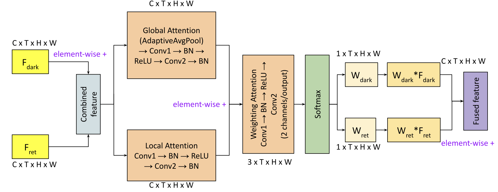
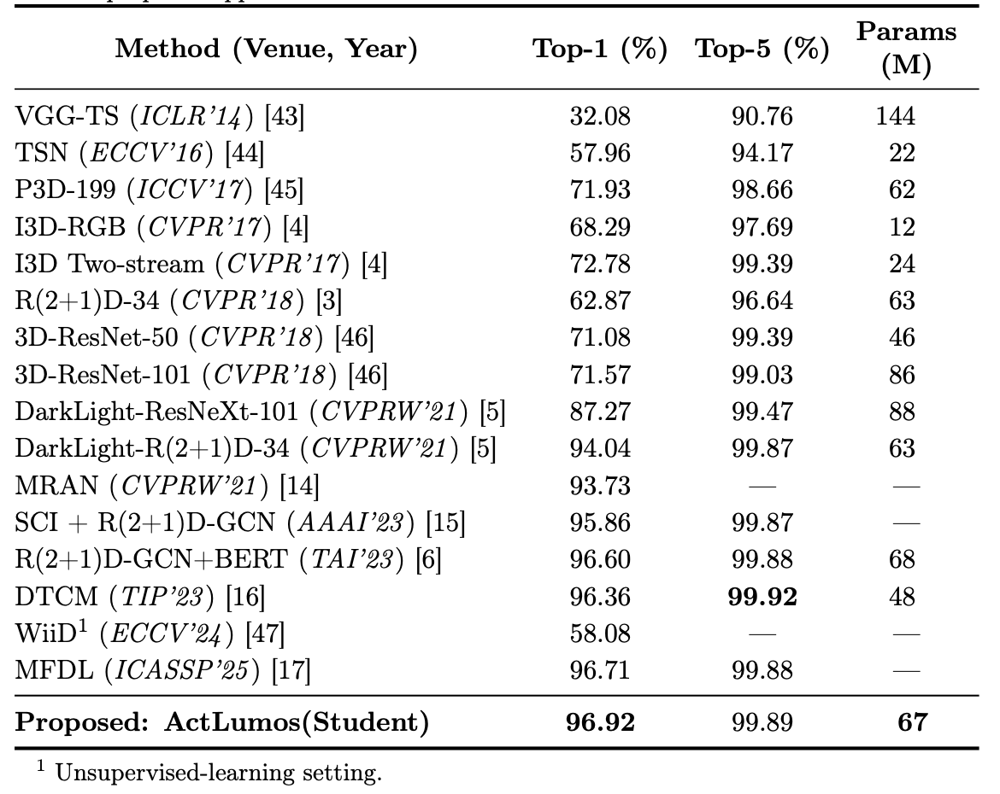
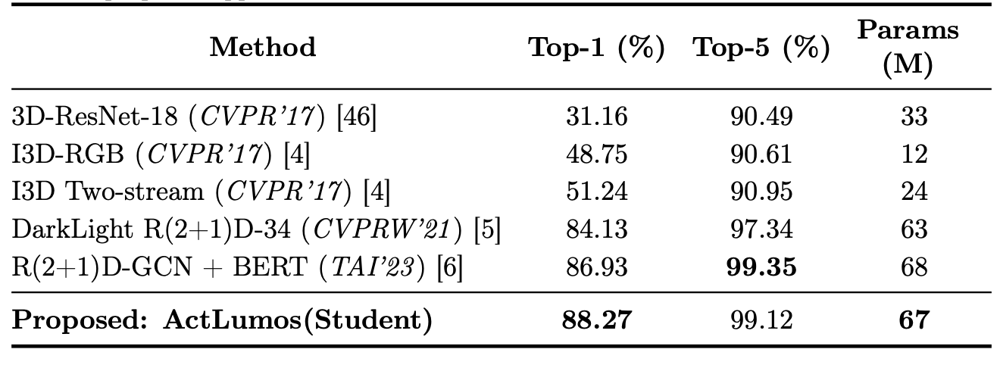

# We will release the code soon!! #

# Seeing in the Dark: A Teacher–Student Framework for Dark Video Action Recognition via Knowledge Distillation and Contrastive Learning

This page contains all the Datasets and Code bases (experiments and evaluations) involved in experimenting and establishing our newly proposed **ActLumos** framework for video action recognition in the Dark.

The official repository of the paper with supplementary: [MD-BERT](https://arxiv.org/pdf/2502.03724) | 

## About the project

This project is a carried out in [Monash University, Malaysia campus](https://www.monash.edu.my/).

Project Members -                                                                                                                                                                                                                                                                      
[Sharana Dharshikgan Suresh Dass](https://www.linkedin.com/in/sharana-dharshikgan-suresh-dass-361167191/?originalSubdomain=my) [(Monash University, Malaysia)](https://www.monash.edu.my/)                                                                                             
[Hrishav Bakul Barua](https://www.researchgate.net/profile/Hrishav-Barua)  [(Monash University, Australia and TCS Research, Kolkata, India)](https://www.tcs.com/what-we-do/research),                                                                                                         
[Ganesh Krishnasami](https://research.monash.edu/en/persons/ganesh-krishnasamy) [(Monash University, Malaysia)](https://www.monash.edu.my/)                                                                                                                                         
[Raveendran Paramesran](https://scholar.google.com.my/citations?user=NIbyoq0AAAAJ&hl=en) [(University of Malaya, Malaysia)](https://www.monash.edu.my/)                                                                                                                                   
[Raphaël C.-W. Phan](https://scholar.google.com/citations?user=wR84XY1kACcC&hl=en) [(Monash University, Malaysia)](https://www.um.edu.my/).   

### Funding details
This work is supported by the [`Global Research Excellence Scholarship`](https://www.monash.edu.my/student-services/financial-assistance/postgraduate-scholarships/merit-scholarships), Monash University, Malaysia. This research is also supported, in part, by the prestigious [`Global Excellence and Mobility Scholarship (GEMS)`](https://www.monash.edu.my/research/support-and-scholarships/gems-scholarship), Monash University (Malaysia & Melbourne, Australia).

## Overview

Action recognition in dark or low-light videos is challenging due to severe visibility degradation that obscures critical spatiotemporal cues. This paper presents ActLumos, a teacher–student framework that achieves single-stream inference efficiency with multi-stream-level accuracy. The teacher network processes dual inputs—original dark frames and Retinex-enhanced frames—through weight-shared R(2+1)D-34 backbones and dynamically fuses them using a Dynamic Feature Fusion (DFF) module, guided by a supervised contrastive loss (SupCon) to enhance class separability. The student network, using only dark frames, is pretrained with self-supervision on unlabeled clips and fine-tuned via knowledge distillation from the teacher, inheriting its multistream knowledge. ActLumos achieves state-of-the-art results with 96.92% (Top-1) on ARID V1.0, 88.27% on ARID V1.5, and 48.96% on Dark48. Ablation studies confirm the effectiveness of each component, demonstrating superior dark-video recognition without additional inference cost.

### Overall Architecture

### Constrastive Learning

Self-supervised vs supervised contrastive learning. Left (self-supervised): the
anchor clip (class Pick) has only its own augmented view as a positive ($${\color{pink}pink}$$ edge), all
other clips in the batch are treated as negatives ($${\color{green}green}$$). Right (supervised): with labels,
every clip from the same class Pick including dark and retinex views of different instances
is a positive ($${\color{pink}pink}$$), while clips from other classes are negatives ($${\color{green}green}$$).

### The Dynamic Feature Fusion (DFF) module proposed in our Architecture

### Dataset samples

We use gamma correction and retinex-enhanced images alongside raw dark frames as input to our pipeline. Examples of dark frames (top) and their retinex-enhanced counterparts (middle) and gamma-corrected frames, across actions (pour, pick, walk, stand, drink).

## Our work utilizes the following:

### <ins>Basic Neural Network and DL models</ins>

`ICLR 2015` | `VGG-TS` - Very Deep Convolutional Networks for Large-Scale Image Recognition | [Code](https://github.com/Prabhu204/Very-Deep-Convolutional-Networks-for-Large-Scale-Image-Recognition)

`ECCV 2016` | `TSN` - Temporal Segment Networks: Towards Good Practices for Deep Action Recognition | [Code](https://github.com/Ruiyang-061X/TSN)

`CVPR 2017` | `I3D-RGB`, `I3D Two-stream` - Quo Vadis, Action Recognition? A New Model and the Kinetics Dataset | [Code](https://github.com/piergiaj/pytorch-i3d)

`ICCV 2017` | `Pseudo-3D-199` - Learning Spatio-Temporal Representation with Pseudo-3D Residual Networks | [Code](https://github.com/ZhaofanQiu/pseudo-3d-residual-networks)

`CVPR 2018` | `R(2+1)D` -  A closer look at spatiotemporal convolutions for action recognition | [Code](https://github.com/leftthomas/R2Plus1D-C3D)

`CVPR 2018` | `3D-ResNet-18`, `3D-ResNet-50`, `3D-ResNet-101` - Can Spatiotemporal 3D CNNs Retrace the History of 2D CNNs and ImageNet? | [Code](https://github.com/kenshohara/3D-ResNets-PyTorch)

`NAACL 2019` | `BERT` - BERT: Pre-training of Deep Bidirectional Transformers for Language Understanding | [Code](https://github.com/google-research/bert)

### <ins>State-of-the-art learning models for action/activity recognition in the dark</ins>

`CVPRW 2021` | `DarkLight-ResNeXt-101`, `DarkLight-R(2+1)D-34` - DarkLight Networks for Action Recognition in the Dark | [Code](https://github.com/Ticuby/Darklight-Pytorch)

`CVPRW 2021` | `MRAN` - Delta Sampling R-BERT for Limited Data and Low-Light Action Recognition | [Code](https://openaccess.thecvf.com/content/CVPR2021W/UG2/papers/Hira_Delta_Sampling_R-BERT_for_Limited_Data_and_Low-Light_Action_Recognition_CVPRW_2021_paper.pdf)

`IEEE TAI 2022` | `R(2+1)D-GCN+BERT` - Action Recognition in Dark Videos using Spatio-temporal Features and Bidirectional Encoder Representations from Transformers | [Code](https://www.isical.ac.in/~ash/Action_Recognition_in_Dark_Videos_using_Spatio-temporal_Features_and_Bidirectional_Encoder_Representations_from_Transformers.pdf)

`AAAI 2023` | `SCI + R(2+1)D-GCN` - Two-Streams: Dark and Light Networks with Graph Convolution for Action Recognition from Dark Videos | [Code](https://ojs.aaai.org/index.php/AAAI/article/view/27030)

`IEEE TIP 2023` | `DTCM` - DTCM: Joint Optimization of Dark Enhancement and Action Recognition in Videos | [Code](https://www.researchgate.net/publication/371698911_DTCM_Joint_Optimization_of_Dark_Enhancement_and_Action_Recognition_in_Videos)

`ECCV 2024` | `WiiD` - Watching it in Dark: A Target-aware Representation Learning Framework for High-Level Vision Tasks in Low Illumination | [Code](https://github.com/ZhangYh994/WiiD)

`ICASSP 2025` | `MFDL` - Advancing Dark Action Recognition via Modality Fusion and Dark-to-Light Diffusion Model | [Code](https://ieeexplore.ieee.org/document/10890723) 
 

### <ins>Action recognition datasets for dark videos</ins>

`DL-HAR 2020` | `ARID V1.0` & `ARID V1.5` | ARID: A New Dataset for Recognizing Action in the Dark | [Link1](https://github.com/xuyu0010/ARID_v1); [Link2](https://xuyu0010.github.io/arid.html)

`ACCV 2024` | `ELLAR` | An Action Recognition Dataset for Extremely Low-Light Conditions with Dual Gamma Adaptive Modulation | [Link](https://sites.google.com/view/knu-ellar/)

`IEEE TIP 2023` | `Dark48` | Dark-48: a dark video dataset for action recognition in the dark | [Link](https://github.com/yzfly/Dark48)

## Experiments and Results

**Table 1:** Top-1 and Top-5 accuracy results on ARID V1.0 for several competitive methods
and our proposed approach

**Table 2:** Top-1 and Top-5 accuracy results on ARID V1.5 for several competitive methods
and our proposed approach

**Table 3:** Top-1 and Top-5 accuracy results on Dark48 for several competitive methods and
our proposed approach

For more details and experimental results please check out the paper!!

##  Citation 

If you find our work (i.e. the code, the theory/concept, or the dataset) useful for your research or development activities, please consider citing our work as follows:

~~~
@article{dass2025md,
  title={MD-BERT: Action Recognition in Dark Videos via Dynamic Multi-Stream Fusion and Temporal Modeling},
  author={Dass, Sharana Dharshikgan Suresh and Barua, Hrishav Bakul and Krishnasamy, Ganesh and Paramesran, Raveendran and Phan, Raphael C-W},
  journal={arXiv preprint arXiv:2502.03724},
  year={2025}
}
~~~

## License and Copyright

~~~
----------------------------------------------------------------------------------------
Copyright 2024 | All the authors and contributors of this repository as mentioned above.
----------------------------------------------------------------------------------------

~~~

Please check the [License](LICENSE) Agreement.

